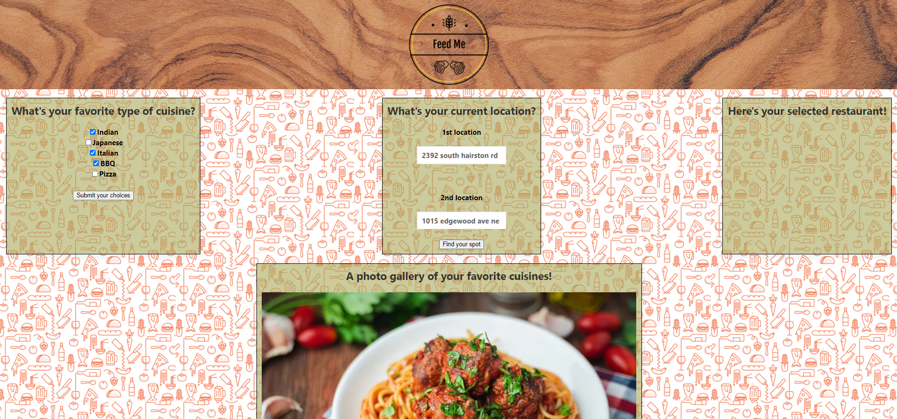

# feed-me-tm
A project for hungry people

## Concept
This website answers the age old question, "where should we eat?" Wonder no more! Have we got the site for you!

With our app, we tried to help people complete the ardous task of picking a restaurant for dinner. Start by picking your cuisine, enter your address, enter your friends address, and Feed Me will find a restaurant for you.

## User Story

>AS AN indecisive hungry person with a group of equally indecisive friends
>
>I WANT someone else to pick a restaurant
>
>SO THAT we can get food without needing to make a decision

___
## Process
For our group Tyler worked on the frontend and Deepali and Alyssa worked on the backend. We met every day to discuss tasks and decided what parts we would each work on. Bounce ideas off each other and make sure we were all on the same page. This made it easy to decide who was best suited to write each part, especially on the backend part. 

### Technologies Used

-[UIKit](https://getuikit.com/)

-[Google Maps Geocoding API](https://rapidapi.com/googlecloud/api/google-maps-geocoding)

-[Zomato API](https://www.zomato.com/atlanta0)

### Challenges
One major challenged we faced was how to find a distance between two addresses that we could use for our zomato api call. At first we were thinking there might be a way to calculate the distance between the addresses, but that didn't work for a number of reason. First, how would we find a third address between the two points. Second, what kind of complicated math would we need to do. 

Fortunantly the zomato api can use latitude and longitude. Using the google geocoding api, we were able to pull the latitudes and longitudes from the two addresses that were entered. We wrote some math to divide those latitudes and longitudes by 2 to find the address. We then passed the new latitude and longitude to the zomato api call. 

For the frontend, the initial framework that we picked wasn’t working out how we wanted, so Tyler scrapped it about midway through and then remade the site. The original framework wasn’t really as fluid as we wanted it to be. And switching to flexbox made a huge difference. 

We originally wanted to use Yelp and Google Maps API's, but they require a lot of security, so we switched to a Rapid API and the Zomato API. 

### Successes
A huge success was getting the location functionality to work. We were able to get the math working, and that felt really good. 

We had to use the first Geocoding call to trigger the second Zomato API call. Getting the API calls working together was a big success. 

Deepali also figured out how to get the Geocoding call to wait to get the latitude and longitude from two addresses and then use that information. 

Our group worked together really well. We were able to get the merges working pretty well and we did a good job handling github. One of the things that worked out really well was doing the merge conflicts together. It was good to have a few sets of eyes to make sure that we had the correct code to merge. 
___

## Links

[Repo](https://github.com/a-andres1/feed-me-tm)

[Deployed Site](https://a-andres1.github.io/feed-me-tm/)

## Screenshot

___
## Directions for Future Development
1. Create more options for narrowing down resturant through catagories like:
    - Outdoor seating
    - Kid friendly
    - Live music
    - Vegetarian/Vegan
    - Bars
2. Add a drop down menu instead of checkboxes for cuisine types
3. Offer more cuisine types
4. Display a map with directions to your location
5. Display reviews
6. Display the price range of the restuarant 
